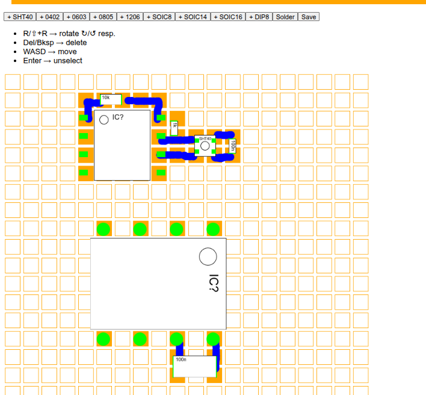

# SMD Editor

This is a tool to lay out electronic circuits on prototyping boards, for hand soldering. It allows you to plan a
circuit's layout (component placements and connections) before physically soldering them.

The editor looks like this:

## Features

The editor currently supports [the SMTPads 50x50 protoboard](https://www.busboard.com/SP1-50x50-G) by BusBoard Prototype
Systems, which has square SMD pads in a 50-mil grid (for finer surface-mount devices, down to SOIC and 0402 passives,
possibly TSSOP with some manual modifications). It also supports the more traditional through-hole pads in a 100-mil
grid, such
as [Adafruit's Universal Proto-board PCBs](https://www.adafruit.com/product/4785), which works fine with DIP packages,
through-hole devices and larger SMD components (though not SOIC and finer pitch):

|  |  |
|-----------------------------------------------------------------------------------------------------------------------------------|----------------------------------------------------------------------------------------------------------------------|

Currently, there are footprints for the following devices:

* SOIC packages, 8-, 14- and 16-pins
* DIP packages, 8-pins
* SMD 2-terminal passives (resistors, capacitors, LEDs), 0402, 0603, 0805 and 1206 imperial sizes
* The [SHT40](https://sensirion.com/products/catalog/SHT40) temperature and humidity sensor by Sensirion

