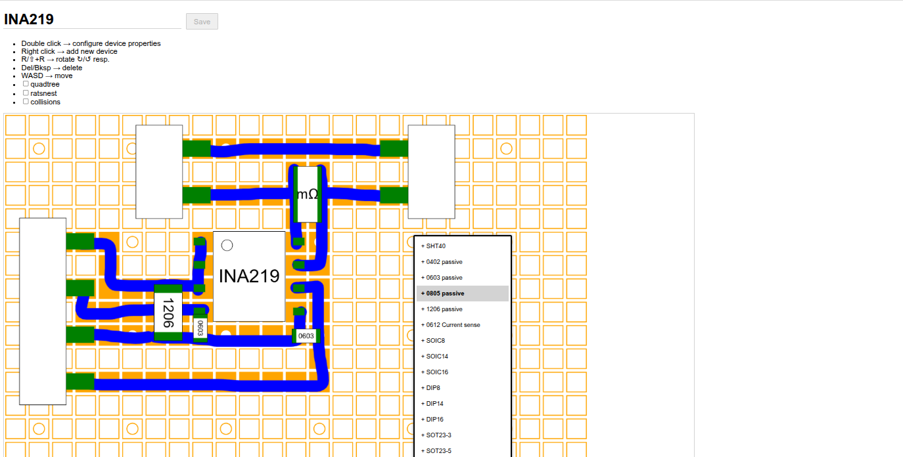
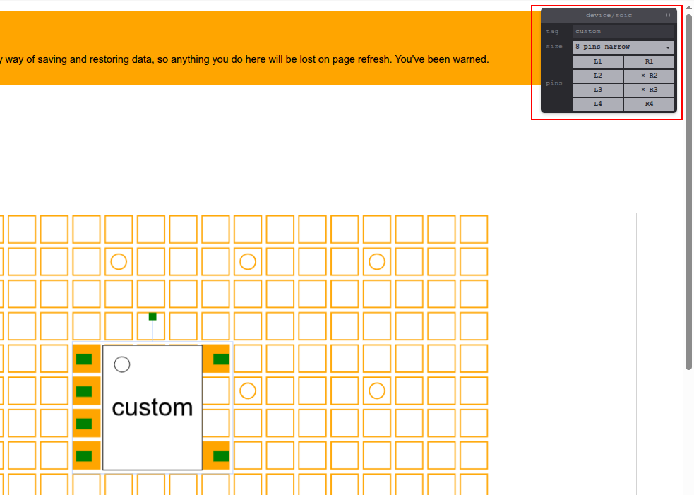
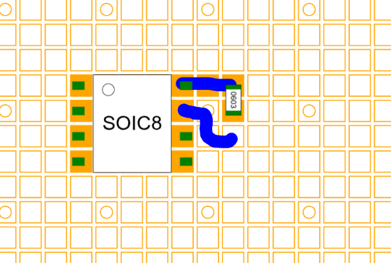
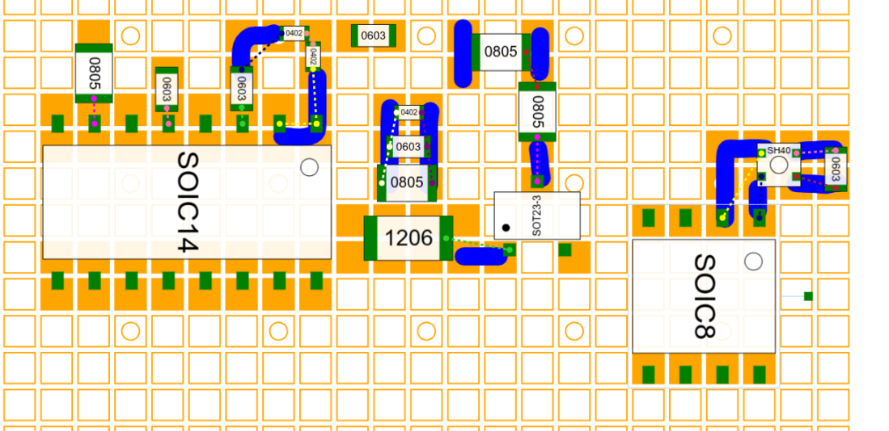
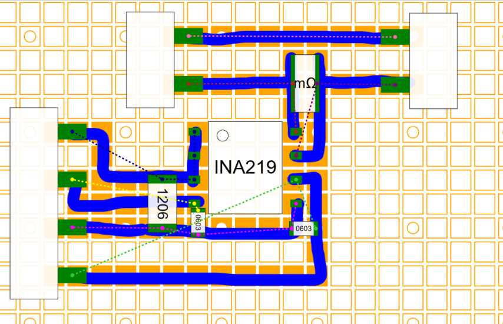

# SMD Editor

This is a tool to lay out electronic circuits on prototyping boards, for hand soldering. It allows you to plan a
circuit's layout (component placements and connections) before physically soldering them.

The editor looks like this:

Usage:

* Right-click to open the Devices selector, on which you can add a new device (or a solder line)
* Drag and drop devices to move them around. Their electrical connectivity (to protoboard pads, solder lines, or other 
  devices' pins) will be automatically updated
* For most devices, double-click on them to 
* Press the Delete or Backspace keys to delete the currently selected device
* Press the R key to rotate the device 90 degrees clockwise. Press Shift+R to rotate 90 degrees counterclockwise
* Press the arrow keys or WASD to move the currently selected device. Also hold Shift for larger steps
* Press the $ key to open a debug menu, where some internal visualizations can be toggled on/off

## Features

### Boards

The editor currently supports [the SMTPads 50x50 protoboard](https://www.busboard.com/SP1-50x50-G) by BusBoard Prototype
Systems, which has square SMD pads in a 50-mil grid (for finer surface-mount devices, down to SOIC and 0402 passives,
possibly TSSOP with some manual modifications). It also supports the more traditional through-hole pads in a 100-mil
grid, such
as [Adafruit's Universal Proto-board PCBs](https://www.adafruit.com/product/4785), which works fine with DIP packages,
through-hole devices and larger SMD components (though not SOIC and finer pitch):

|  |  |
|-----------------------------------------------------------------------------------------------------------------------------------|----------------------------------------------------------------------------------------------------------------------|

### Devices

Currently, there are footprints for the following devices:

* SOIC packages, 8-, 14- and 16-pins
* DIP packages, 8-, 14- and 16-pins
* SOT23 package, 3-, 5- and 6-pin variants
* Plus the ability to remove specific pins on SOIC, DIP and SOT23 packages (e.g. for high-voltage packages that may skip a pin for isolation purposes)
* SMD 2-terminal passives (resistors, capacitors, LEDs), 0402, 0603, 0805 and 1206 imperial sizes
* The [SHT40](https://sensirion.com/products/catalog/SHT40) temperature and humidity sensor by Sensirion

Most devices have configurable parameters (e.g. the name of a SOIC device), which are controlled by double-clicking the 
device. This pops up a parameters panel on the top right corner:

### Solder and connectivity

The Solder component allows you to draw solder lines to connect device pins. Solder lines cause all pads and pins that 
touch to become electrically connected.

To show all the device pins that are interconnected together, press the $ key to open the hidden debug menu, and then
enable the Ratsnest checkbox. This will display lines that connect device pins that are electrically connected. Two 
pins are connected if they physically touch, share a board pad, or they are connected via solder lines. This is equivalent to a 
"netlist" in a schematic program. Note the colored dashed lines in the images below, they indicate pins which are
connected to each other and therefore belong to the same net (assumed to always be at the same voltage at all times, 
except for transmission line delays, at which point you probably shouldn't be using a protoboard anyway):

### DEV

Known errors/TODOs:

- [x] BUG solderlines restored from LS don't have collisions anymore
    - even if dragging!
- [x] BUG SOIC&DIP devices don't preserve their disabled pins on save->restore
- [x] BUG dragging a group of things breaks colldet against the protoboard
    * check if it's that the move event fires on the group and doesn't propagate to the individual (Device|Path)s
    - [ ] BUG2 now it works while dragging but colldet breaks after deselecting
- [ ] BUG repeatedly removing&readding a whole side of pins (for SOIC, DIP, SOT23 packages) messes up side-to-side alignment
- [ ] BUG component labels (tag) aren't stored if they have changed

- [x] add holes every 4 pads in X, Y
- [x] readd the through-hole protoboard
  - [ ] some way of changing from SMD to TH proto?
  - [x] BUG colldet of L-shaped solder uses BB of entire solderline
- [x] preview the board saved on LocalStorage
    - [x] render as PNG???
- [ ] clear the saved board
- [x] add the params for Passive and SOIC
    * \+ make it work without needing a Save button
    * ✓ see if ButtonGrid and others are usable
- [x] allow hiding some pins in SOIC devices
  - [x] also on DIP and SOT23
- [x] see if it's possible to have the num of pins for SOIC devs as a Tweakpane param
- [x] readd DIP devices
- [x] add SOT-23 devices
    * maybe as SOT-23-6 with deletable pins?
- [x] right-click context menu to add new Device, replace the list of buttons
  - [x] BUG don't add new devices outside the visible canvas area
- [ ] undo/redo stack???
- [ ] netlist-ish features
    - [x] link pin->pin, display ratsnest unless connected via pads/solder
    - [x] euclidean minimum spanning tree for cleanest ratsnest, currently it can jump around
    * show netlist as text
    * import from some standard netlist format???
    * export to some standard netlist format???
- [ ] import KiCAD schematic?
    - \+ netlist/connectivity
    - \+ component footprints???